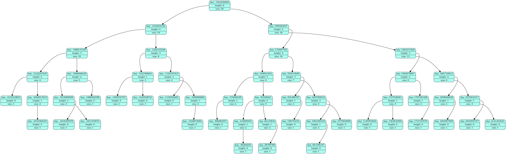

# Search tree implementation (AVL tree)
### About
1. First level  
This program finds a range of values in a balanced search tree in O(log(n)) complexity,  
thereby overtaking **std::distance()** function which works for O(n).  
2. Second level  
This program responds to two types of queries:  
- Query (m) to find the k-th smallest element.  
- Query (n) to search for the number of elements smaller than the specified one.  
## Requirements
**cmake** version must be 3.15 or higher
## How to build
```bash
git clone git@github.com:VictorBerbenets/Search-Tree.git
cd Search-Tree/
cmake -S ./ -B build/ -DCMAKE_BUILD_TYPE=Release [-DHWT_SECOND_LEVEL=ON/OFF]
cd build/
cmake --build .
```
## To Run the program do
```bash
./search_tree
```
If `-DHWT_SECOND_LEVEL=OFF`  
The programm will be waiting for input data in stdin in such way:  
```bash
<k> key1 <k> key2 ... <q> begin end ...
```
**k** - integer key attribute  
**q** - range attribute. After **q** we get the beginning and end of the search range.  
At the end, the program will output a list of distances for each query **q**.  
If `-DHWT_SECOND_LEVEL=ON`  
The programm will be waiting for input data in stdin in such way:  
```bash
<k> key1 <k> key2 ... <n> upper_bound1 <m> min_elem1 ...
```
**k** - integer key attribute  
**n** - range attribute. After **n** we get an upper bound for finding keys.  
**m** - range attribute. After **m** we get k-th smallest key to find.  
At the end, the program will output the answers to each query.  
## How to run tests:
### You can run unit tests:
```bash
./tests/unit
```
### Or you can run end2end tests:
```bash
bash ../tests/end2end/test_runner.sh <tests_number> <keys_number> <queries_number>
```
**tests_number** - the number of tests you want to generate.  
**keys_number**  - number of keys to be generated.  
**queries_number** - number of queries to be generated.  
After running you can see a generated directory - tests/end2end/resources/.  
There will be the tests themselves and the answers to them.
## How to run compare programm:
```bash
bash ../compare/compare.sh
```
This program will output to a file **compare/compare.txt** comparison of the performance time  
of the distance method in the AVL tree and **std::distance()**.  
Make sure that you have generated end2end tests before, so they are taken for comparison.
## Graphviz AVL tree visualization

